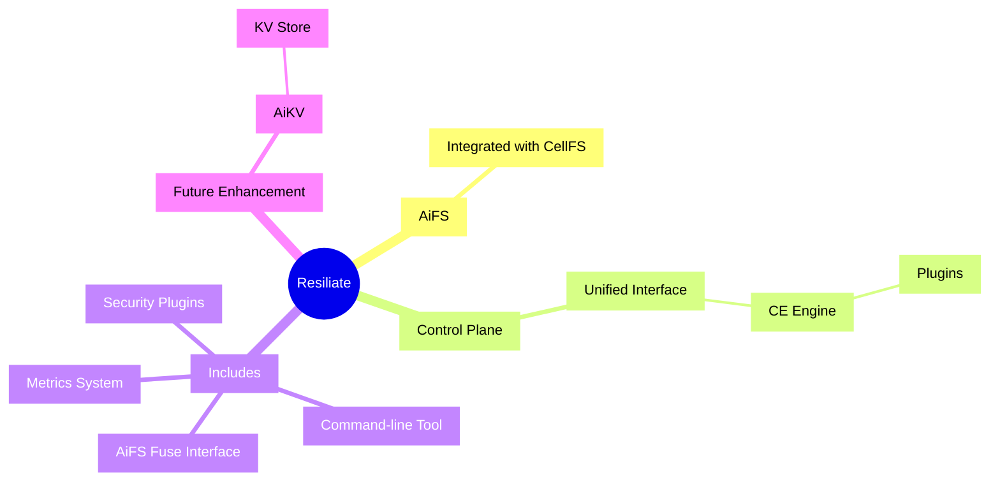

# Introduction to Resiliate™ 2.0

<!-- toc -->

Welcome to Resiliate, a AI-driven data resiliency software solution designed to
mitigate the effects of ransomware and other malicious activities that lead to
data loss. Resiliate is an advanced filesystem that aims to prevent data loss,
provide quick recovery options, and achieve short Recovery Point Objectives (RPO)
and Recovery Time Objectives (RTO).

## What's new in Resiliate™ 2.0?

Resiliate introduces several new features allowing greater flexibility and
customization for a wide range of enterprise needs, including a unified
interface, the Cybernetic Engram engine, plugins, back-end stores,
and statistical and AI models.

* **Plugin-Driven System:** Resiliate™ 2.0 is plugin-driven, allowing for greater
  flexibility and extensibility.

* **Support for Multiple Filesystems:** Resiliate™ 2.0 is designed to work with
  multiple filesystems, providing users with more options and flexibility.

* **Improved Transparency:** The internal state of the system is exposed via the
  Control Plane filesystem, providing insights into its decision-making process.

* **Easier Deployment and Data Import:** Resiliate™ 2.0 simplifies both deployment
  and data import, making it easier for users to get started with the system.

* **Enhanced Auditing Capabilities:** Deep auditing of filesystem operations is
  introduced using Cybernetic Engrams (CEs).

## Key Features of Resiliate™ 2.0

* **Cybernetic Engram (CE) Engine:** The CE engine evaluates and performs inferences
  based on the state of the data, system, users, groups, processes, and history,
  resulting in security recommendations for file operations.

* **Plugins:** Plugins are dynamic libraries that implement the CePlugin trait.
  They can evaluate filesystem operations and provide recommendations on what
  should happen next.

* **Control Plane:** The Control Plane provides a unified interface for interacting
  with the CE engine, plugins, back-end stores, and the statistical and AI models.

## Resiliate™ Package

Resiliate™ is the overall package that bundles AiFS, utilities, CellFS kernel DKMS
module, and various other add-on packages. It is supported on various platforms,
including x86_64 and IBM System Z.

## Future Enhancements

* **Advanced Security Plugins:** Enhanced security plugins are planned for AiFS,
  which will provide mandatory access control, mandatory integrity controls, and
  augmentation of Fuzzy Multi-level Security using user-behavior and data-behavior
  inferences driven both by statistical models and possibly AI.

* **AiKV:** AiKV is a planned Key-Value (KV) store that will provide SQL or S3
  bucket semantics.

* **3rd-party Audit and Monitoring helper-tools:** Helper tools such as docker configs
  are planned to make it easier to get going with system monitoring and statistics
  collection.
