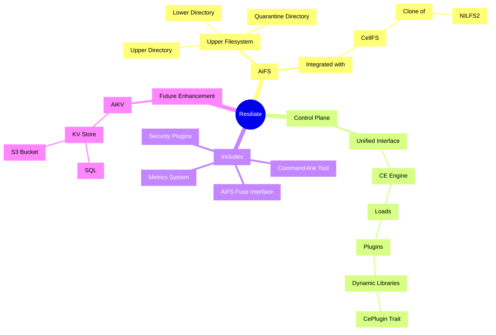

# Introduction to Resiliate® 2.0

Welcome to Resiliate® 2.0, an enterprise-level software package designed to mitigate
the effects of ransomware and other malicious activities that lead to data loss.

At the heart of Resiliate® is AiFS, an advanced filesystem that aims to prevent
data loss, provide quick recovery options, and achieve short Recovery Point
Objectives (RPOs) and Recovery Time Objectives (RTOs).

<!----
## What's new in Resiliate® 2.0?

Resiliate® 2.0 is a complete rewrite of the original Resiliate® 1.0. It is a
plugin-driven system that provides a unified interface for interacting with
the filesystem, the CE engine, plugins, back-end stores, and the statistical
and AI models.

### Resiliate® 1.0 vs Resiliate 2.0

Resiliate 2.0 combines the design and implementation of the filesystem structure,
the CE engine, and plugins, all bundled into an enterprise-level product.
Whether you're looking to combat ransomware, wiper-ware, or data exfiltration,
Resiliate® is equipped to handle it all.

<em>Click to expand to get details on limitations of Resiliate 1.0</em>

While both Resiliate® 1.0  was a comprehensive  solution for preventing data
loss and providing quick recovery options, it had several limitation:

* Resiliate 1.0 was a monolithic system that was not plugin-driven.
* Resiliate only supported CELLFS as the underlying filesystem.
* Users had no way to peer into the internal state of the system, its decision
  making, or the state of the data.
* While Resiliate 1.0 was a general purpose filesystem, deploying it on existing
  data storage was difficult, and importing existing data was harder still.
* The auditing capabilities in Resiliate 1.0  was no  to deploy it on existing
  data stores.

  

### Changes from Resiliate® 1.0

Following are some of the key changes from Resiliate® 1.0:

* Deep auditing of filesystem operations using Cybernetic Engrams (CEs).

  * CEs are the core of the system and are used to evaluate and perform inferences
    based on the state of the data, system, users, groups, processes, and history.

    The CEs now expose their internal state via the [Control Plane](#control-plane)
    filesystem

* CellFS is now a separate package that can be used independently of Resiliate®.

-->

It's great to see such a comprehensive overview of Resiliate® 2.0. Here's a
revised version of the "What's new in Resiliate® 2.0?" section, highlighting the
improvements over Resiliate® 1.0 and the new features introduced in Resiliate® 2.0:

## What's new in Resiliate® 2.0?

Resiliate® 2.0 is a significant upgrade from its predecessor, Resiliate® 1.0.
The new version is a complete rewrite, transforming Resiliate® into a plugin-driven
system. This change allows for greater flexibility and customization, catering
to a wide range of enterprise needs.

In Resiliate® 2.0, we've introduced a unified interface for interacting with the
filesystem, the CE engine, plugins, back-end stores, and the statistical and AI
models. This unified interface enhances the user experience, making it easier to
interact with and manage the system.

### Improvements from Resiliate® 1.0

Resiliate 2.0 combines the design and implementation of the filesystem structure,
the CE engine, and plugins, all bundled into an enterprise-level product.
Whether you're looking to combat ransomware, wiper-ware, or data exfiltration,
Resiliate® is equipped to handle it all.
Resiliate® 2.0 addresses several limitations of the previous version:

<em>Click to expand to get details on limitations of Resiliate 1.0</em>

While both Resiliate® 1.0  was a comprehensive  solution for preventing data
loss and providing quick recovery options, it had several limitation:

* Resiliate 1.0 was a monolithic system that was not plugin-driven.
* Resiliate only supported CellFS as the underlying filesystem.
* Users had no way to peer into the internal state of the system, its decision
  making, or the state of the data.
* While Resiliate 1.0 was a general purpose filesystem, deploying it on existing
  data storage was difficult, and importing existing data was harder still.
* The auditing capabilities in Resiliate 1.0  was no  to deploy it on existing
  data stores.

  

* **Plugin-Driven System:** Unlike Resiliate® 1.0, which was a monolithic system,
  Resiliate® 2.0 is plugin-driven. This design allows for greater flexibility and
  extensibility, enabling users to customize the system to meet their specific needs.

* **Support for Multiple Filesystems:** While Resiliate® 1.0 only supported
  CellFS as the underlying filesystem, Resiliate® 2.0 is designed to work with
  multiple filesystems. This change provides users with more options and flexibility.

* **Improved Transparency:** In Resiliate® 1.0, users had no way to peer into the
  internal state of the system, its decision-making process, or the state of the
  data. Resiliate® 2.0 addresses this limitation by exposing the internal state
  of the system via the Control Plane filesystem.

* **Easier Deployment and Data Import:** Deploying Resiliate® 1.0 on existing data
  storage was difficult, and importing existing data was even more challenging.
  Resiliate® 2.0 simplifies both deployment and data import, making it easier for
  users to get started with the system.

* **Enhanced Auditing Capabilities:** Resiliate® 2.0 introduces deep auditing of
  filesystem operations using Cybernetic Engrams (CEs). This feature provides
  users with detailed insights into filesystem operations, enhancing security and
  accountability.

### Key Features of Resiliate® 2.0

Here are some of the key features introduced in Resiliate® 2.0:

* **Cybernetic Engram (CE) Engine:** The CE engine is the core of Resiliate® 2.0.
  It evaluates and performs inferences based on the state of the data, system,
  users, groups, processes, and history, resulting in security recommendations
  for file operations.

* **Plugins:** Resiliate® 2.0 introduces plugins, which are dynamic libraries
  that implement the CePlugin trait. These plugins can evaluate filesystem operations
  and provide recommendations on what should happen next.

* **Control Plane:** The Control Plane provides a unified interface for interacting
  with the CE engine, plugins, back-end stores, and the statistical and AI models.
  It is implemented as a filesystem, with each plugin having its own directory.

----- 

## Key Components

### AiFs

AiFS is the upper filesystem that provides POSIX semantics out-of-the-box.
It's structured with an upper directory (working directory),
a quarantine directory, and a lower directory (containing most of the data).

AiFS coordinates the filesystem operations for each request based on the results
provided by _Cybernetic Engrams_ of each file.

### CellFS

CellFS is a clone of NILFS2 that we've created due to some limitations of NILFS2.
CellFS is used by the system and integrated with AiFS through a plugin interface.

### Cybernetic Engram (CE) Engine

The CE engine is the AiVM that _runs_ the Cybernetic Engrams to evaluate and
perform inferences based on the state of the data, system, users, groups,
processes, and history resulting in security recommendations for file operations.

### Plugins

Plugins are dynamic libraries that implement the CePlugin trait. They are
loaded by the CE at runtime based on the configuration file. Each plugin can
evaluate filesystem operations and provide a recommendation on what should
happen next.

### Control Plane

The control plane provides a unified interface for interacting with CE Engine, plugins,
back-end stores, and the statistical and AI models. It is implemented as a filesystem,
with each plugin having its own directory.

## Resiliate® Package

Resiliate® is the overall package that bundles AiFS, utilities, CellFS kernel DKMS
module, and various other add-on packages.

This is also plugin-driven, and there are packages for each of these. Resiliate®
is supported on various platforms, including x86_64 and IBM System Z.

In summary, Resiliate® is a comprehensive solution for preventing data loss and
providing quick recovery options. It combines the design and implementation of
the filesystem structure, the CE engine, and plugins, all bundled into an
enterprise-level product. Whether you're looking to combat ransomware,
wiper-ware, or data exfiltration, Resiliate® is equipped to handle it all.

## More to come&hellip;

### Advanced Security Plugins

Enhanced security plugins are planned for AiFS, which will provide mandatory
access control (using Bell-LaPadula), mandatory integrity controls (supports
Biba and Clarke-Wilson models), and augmentation of Fuzzy Multi-level Security
(FuzzyMLS) using user-behavior and data-behavior inferences driven both by
statistical models and possibly AI.

### AiKV

AiKV is a planned Key-Value (KV) store that will provide SQL or S3 bucket semantics.

Stay tuned for more updates as we continue to enhance our system with new features
and capabilities. Welcome to the future of data security with Resiliate®!

### 3rd-party Audit and Monitoring helper-tools

You can readily use the AiFS control plane to monitor the system and get all the
statistics and information you need&mdash;including interfacing it directly with
collectors like Prometheus, Grafana, and Microsoft Sentinel.

However, we are planning to provide some helper tools such as docker configs to
make it easier to get going.
