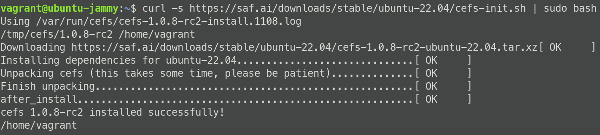

# Installation

Cut and paste the URL for your flavor of Linux Distribution into a
  terminal to begin download and installation:

## Linux

### Ubuntu 22.04 LTS Server


1. **Import the GPG key**: Start by importing the GPG key for the saf.ai
   repository. Execute the following command:

    ```bash
    curl -fsSL https://get.saf.ai/gpg | sudo gpg --dearmor -o /usr/share/keyrings/saf.ai.gpg
    ```

    This command downloads the GPG key, dearmors it, and saves it to your system's
    list of trusted keys.

1. **Add the repository**: Now, add the saf.ai repository to your system's list 
   of software sources. Use the following command:

    ```bash
    curl -fsSL https://get.saf.ai/apt/ubuntu/list | sudo tee /etc/apt/sources.list.d/saf.ai.list
    ```

    This command downloads the repository's list file and saves it in the
    `/etc/apt/sources.list.d` directory.

1. **Create the auth.conf file**: The `auth.conf` file stores HTTP Basic
   authentication credentials for private repositories.
  
   Create it using the following command:

    ```bash
    sudo nano /etc/apt/auth.conf
    ```

    This command opens the `auth.conf` file in the nano text editor.
    If the file doesn't exist, it will be created.

1. **Add the credentials**: In the `auth.conf` file, add the following lines:

    ```bash
    machine get.saf.ai
    login demo
    password <password>password>
    ```

    Replace `<password>` with the actual password provided to you through the
    beta program.

    Save and close the file by pressing `Ctrl+X`, then `Y`, then `Enter`.

1. **Set the permissions**: The `auth.conf` file should be owned by root and
   should have 0600 permissions to keep the credentials secure. Set these
   permissions with the following command:

    ```bash
    sudo chmod 600 /etc/apt/auth.conf
    ```

1. **Update your package lists**: After setting up the `auth.conf` file,
   update your package lists to include the new packages from the saf.ai repository:

    ```bash
    sudo apt update
    ```

1. **Install Resiliate**: Finally, install Resiliate with the following command:

    ```bash
    sudo apt install resiliate
    ```

Remember to run these commands in a terminal window. If you encounter any issues,
make sure you have the necessary permissions to execute these commands.

<!-- 
### Red Hat Enterprise Linux 8 // CentOS 8 Server

``` bash
curl -s {{#include ../../includes.md:cefs-rhel8-url}} | sudo bash
```

### Ubuntu 20.04 LTS Server

``` bash
curl -s {{#include ../../includes.md:cefs-ubuntu-2004-url}} | sudo bash
```

### This should look something like the following

 -->
