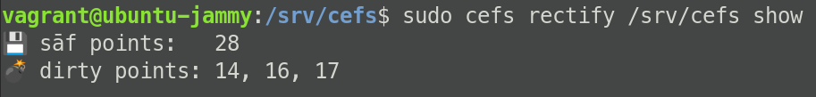

# Create

Let's create some data!

1. On client side, navigate to Resiliate directory.

    ``` bash
    cd ${AIFS_MOUNTDIR}
    ```

2. Copy or extract the test data in the directory. For example, if you
  grabbed 200.zip from
  [{{#include ../../includes.md:test-data-url}}]({{#include ../../includes.md:test-data-url}}),
  you can unzip it in the Resiliate directory.

    ``` bash
    unzip 200.zip
    ```

3. Once your data is finished copying over, look at your Resiliate server
  and list your recovery points using the below command:

    ``` bash
    aifs rectify ${AIFS_MOUNTDIR} show
    ```

This should look something like the following:



> You will notice that as the data copies in, Resiliate will automatically
  create various points of interest and identify them as `sāf` or
  `dirty` points. These recovery points can be made into backups or
  permanent recovery points by manually recovering them.
