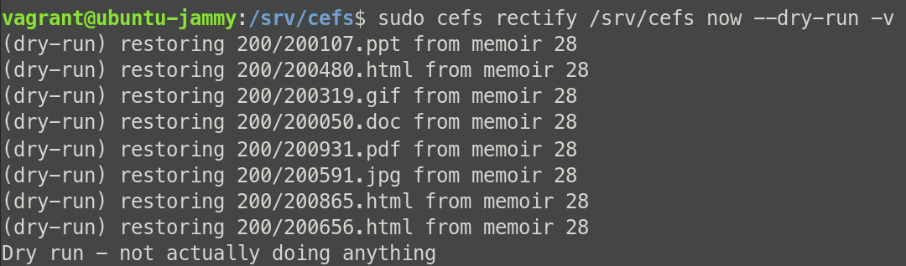

# Rectify

Let's `rectify` your data!

To rescue your data from peril, you simply command Resiliate to `rectify`
  your mounted directory and your data will be recovered. There is
  also manual access if a more granular approach is necessary.

1. Run a `rectify` in dry run mode to see what will be rectified from what point:

    ``` bash
    aifs rectify ${AIFS_MOUNTDIR} now --dry-run -v
    ```

2. Run the `rectify` command in one of the following methods:

    1. Automatically and immediately `rectify` your data:

        ``` bash
        aifs rectify ${AIFS_MOUNTDIR} now
        ```

    2. Alternately, manually set up sāf points and `rectify` from them:

        ``` bash
        aifs rectify ${AIFS_MOUNTDIR} memory ${RECOVERY_ID}
        aifs rectify ${AIFS_MOUNTDIR} from
        ```

3. Your clean data is now available in the mounted directory!

    This should look something like the following:

    

    > Notice that, not only has your *data been restored* but also your
    **permissions and settings**.
