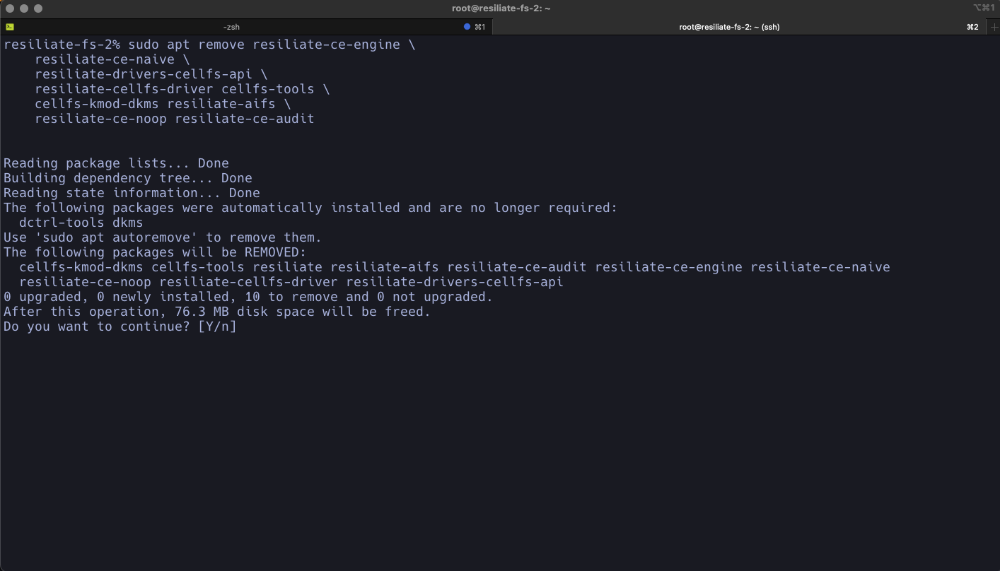
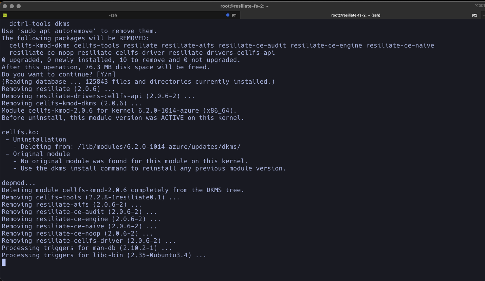
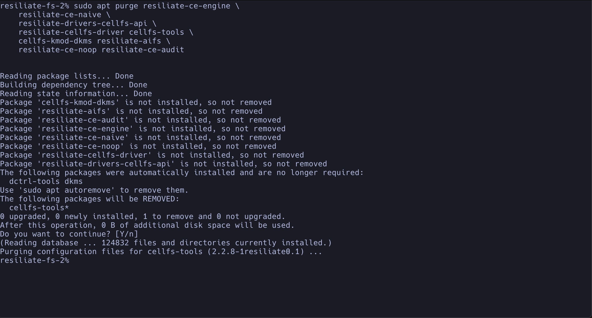
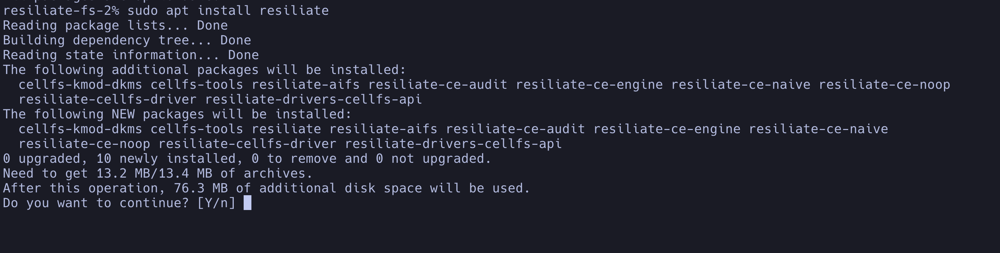

# Fixing Broken Installation of Resiliate on Ubuntu 22.04 LTS Server

## Introduction

This guide aims to help you troubleshoot and fix a broken 
installation of Resiliate on Ubuntu 22.04 LTS Server.
Follow the steps below to uninstall and reinstall Resiliate effectively.

## Uninstalling Resiliate

### Step 1: Remove Resiliate Package

To remove the Resiliate package, run the following command:

```bash
sudo apt remove resiliate-ce-engine \
    resiliate-ce-naive \
    resiliate-drivers-cellfs-api \
    resiliate-cellfs-driver cellfs-tools \
    cellfs-kmod-dkms resiliate-aifs \
    resiliate-ce-noop resiliate-ce-audit
```

#### Please Note the Following Steps



#### You should see:




### Step 2: Remove Configuration Files

If you want to remove all configuration and database files, use the `purge` command:

```bash
sudo apt purge resiliate-ce-engine \
    resiliate-ce-naive \
    resiliate-drivers-cellfs-api \
    resiliate-cellfs-driver cellfs-tools \
    cellfs-kmod-dkms resiliate-aifs \
    resiliate-ce-noop resiliate-ce-audit
```

#### You should see the following:



### Step 3: Update Package Lists

Update your package lists to reflect the removal:

```bash
sudo apt update
```

## Reinstalling Resiliate

### Step 1: Update Package Lists

Before reinstalling, update your package lists:

```bash
sudo apt update
```

### Step 2: Install Resiliate

Run the following command to install Resiliate:

```bash
sudo apt install resiliate
```



## Common Issues and Fixes

### Issue: GPG Key Errors

**Fix**: Re-import the GPG key by running:

```bash
curl -fsSL https://get.saf.ai/gpg | sudo gpg --dearmor -o /usr/share/keyrings/saf.ai.gpg
```

### Issue: Repository Errors

**Fix**: Re-add the repository:

```bash
curl -fsSL https://get.saf.ai/apt/ubuntu/list | sudo tee /etc/apt/sources.list.d/saf.ai.list
```

