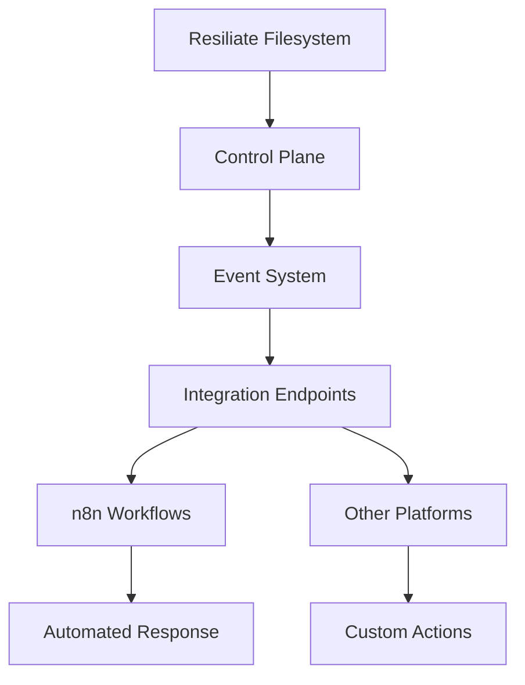

# Integrations

Resiliate™ provides powerful integration capabilities with third-party automation and monitoring platforms, enabling seamless data resiliency workflows and event-driven responses.

## Available Integrations

### [n8n Workflow Automation](n8n/README.md)

The Resiliate Events n8n node enables integration with n8n workflow automation platform, providing:

- **Event-driven workflows** triggered by Resiliate filesystem events
- **Webhook-based communication** for real-time notifications  
- **Automation capabilities** for incident response and data recovery
- **Cross-platform deployment** supporting macOS development and Ubuntu production

### Future Integrations

Additional integrations are planned for:

- **Zapier** - No-code automation platform
- **Microsoft Power Automate** - Business process automation
- **Slack/Teams** - Team communication and alerting
- **SIEM Platforms** - Security incident and event management
- **Monitoring Systems** - Prometheus, Grafana, and other observability tools

## Integration Architecture

Resiliate integrations follow a consistent architecture pattern:

## Getting Started

1. **Choose your integration platform** from the available options
2. **Follow the platform-specific setup guide** for installation and configuration
3. **Configure event routing** to enable communication between Resiliate and your platform
4. **Test your workflows** to ensure proper event handling and response

For detailed implementation guides, see the individual integration documentation pages.
