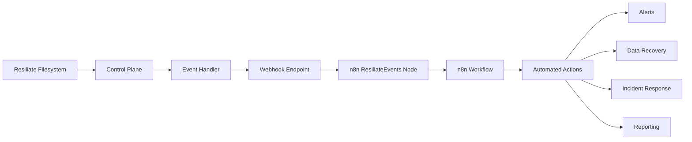

# n8n Integration

The **Resiliate Events n8n Node** provides seamless integration between Resiliate™ filesystem monitoring and n8n workflow automation platform, enabling powerful event-driven automation for data resiliency and incident response.

## Overview

The integration consists of a custom n8n trigger node that receives Resiliate filesystem events via webhooks and forwards them to n8n workflows for automated processing and response.

### Key Features

- **Real-time Event Processing**: Instant webhook-based communication
- **Flexible Workflow Integration**: Compatible with all n8n workflow capabilities
- **Cross-platform Development**: Develop on macOS, deploy to Ubuntu production
- **Visual Workflow Builder**: Drag-and-drop automation design
- **Event Filtering**: Process only relevant Resiliate events
- **Custom Response Actions**: Automated incident response and data recovery

## Architecture



## Current Status - Version 0.1.0

**⚠️ Foundation Release**: Version 0.1.0 provides the core infrastructure and development workflow. Full Resiliate integration features will be implemented in version 0.2.0+.

### What's Available Now

- ✅ **n8n Trigger Node**: Basic webhook-based trigger node framework
- ✅ **Development Workflow**: Complete cross-platform development environment
- ✅ **Docker Integration**: Seamless deployment to containerized n8n instances
- ✅ **Documentation**: Comprehensive setup and development guides
- ✅ **Visual Identity**: Custom ninja icon for easy identification

### What's Coming in v0.2.0+

- 🚧 **Resiliate API Integration**: Direct connection to Resiliate services
- 🚧 **Event Processing Logic**: Intelligent filtering and routing of filesystem events
- 🚧 **Authentication**: Secure API communication with Resiliate Control Plane
- 🚧 **Event Types**: Support for various Resiliate event types (ransomware detection, data corruption, etc.)
- 🚧 **Advanced Features**: Error handling, retry logic, and monitoring

## Quick Start

### Prerequisites

- n8n installed and running (Docker or standalone)
- Node.js 16+ for development
- Git for version control

### Installation

1. **Clone the n8n node repository**:
   ```bash
   git clone git@github.com:safai-labs/resiliate-n8n.git
   cd resiliate-n8n
   git checkout next
   npm install
   ```

2. **Deploy to your n8n instance**:
   ```bash
   # For automated deployment
   ./auto_deploy_from_git.sh
   
   # For manual deployment  
   ./deploy_to_n8n.sh
   ```

3. **Verify installation**:
   - Open your n8n interface
   - Create a new workflow
   - Search for "Resiliate Events" in the node picker
   - The node should appear with a ninja icon

### Basic Workflow Setup

1. **Create a new n8n workflow**
2. **Add the Resiliate Events trigger node**
3. **Configure the webhook endpoint** (automatically generated)
4. **Add processing nodes** for your desired automation:
   - Email notifications
   - Slack/Teams alerts  
   - Database logging
   - Custom API calls
   - Data backup triggers

5. **Activate the workflow**
6. **Test with a sample webhook**:
   ```bash
   curl -X POST [YOUR_WEBHOOK_URL] \
        -H 'Content-Type: application/json' \
        -d '{"event": "test", "data": {"message": "Hello from Resiliate!"}}'
   ```

## Development

### Development Environment

The project supports cross-platform development:

- **Development**: macOS with TypeScript
- **Production**: Ubuntu with Docker
- **Version Control**: Git Flow with main/next branches

### Project Structure

```
resiliate-n8n/
├── nodes/ResiliateEvents/           # Main trigger node
├── credentials/                     # API credentials (future)
├── docs/                           # Development documentation  
├── assets/                         # Icons and visual assets
└── scripts/                        # Deployment and testing tools
```

### Building and Testing

```bash
# Build locally
npm run build

# Test compilation
npm run dev

# Deploy changes
git add . && git commit -m "your changes" && git push origin next
./auto_deploy_from_git.sh  # On Ubuntu server
```

## API Reference

### ResiliateEvents Node

**Type**: Trigger Node  
**Icon**: Custom ninja icon  
**Category**: Trigger  

#### Configuration

Currently accepts all webhook POST requests and forwards raw JSON payload to connected nodes.

#### Output Data

The node outputs the received webhook payload as JSON:

```json
{
  "event": "string",
  "timestamp": "ISO 8601 date",
  "data": {
    // Event-specific data payload
  }
}
```

## Future Enhancements

### Version 0.2.0 - Resiliate Integration
- Direct Resiliate API connectivity
- Event authentication and validation
- Structured event processing
- Error handling and retry logic

### Version 0.3.0 - Advanced Features  
- Event filtering and routing
- Performance optimizations
- Enhanced monitoring and logging
- Custom event transformations

### Version 0.4.0+ - Enterprise Features
- Advanced security features
- Scalability improvements
- Enterprise monitoring integration
- Advanced Resiliate service connectivity

## Troubleshooting

### Common Issues

**Node not appearing in n8n**:
- Check container logs: `docker compose logs n8n`
- Verify file deployment and restart n8n container

**Webhook not receiving events**:
- Ensure workflow is activated
- Check webhook URL configuration
- Verify network connectivity

**Build or deployment failures**:
- Ensure TypeScript compiles locally: `npm run build`
- Check deployment script logs
- Verify Docker container access

### Getting Help

- **Documentation**: https://docs.saf.ai/
- **Project Repository**: https://github.com/safai-labs/resiliate-n8n
- **Issues**: https://github.com/safai-labs/resiliate-n8n/issues
- **Author**: Ahmed Masud <ahmed.masud@saf.ai>

## Contributing

Contributions are welcome! Please:

1. Fork the repository
2. Create a feature branch from `next`
3. Make your changes with proper documentation
4. Test thoroughly
5. Submit a pull request

See the [Development Workflow Guide](../../../n8n/docs/DEVELOPMENT_WORKFLOW.md) for detailed contribution guidelines.
